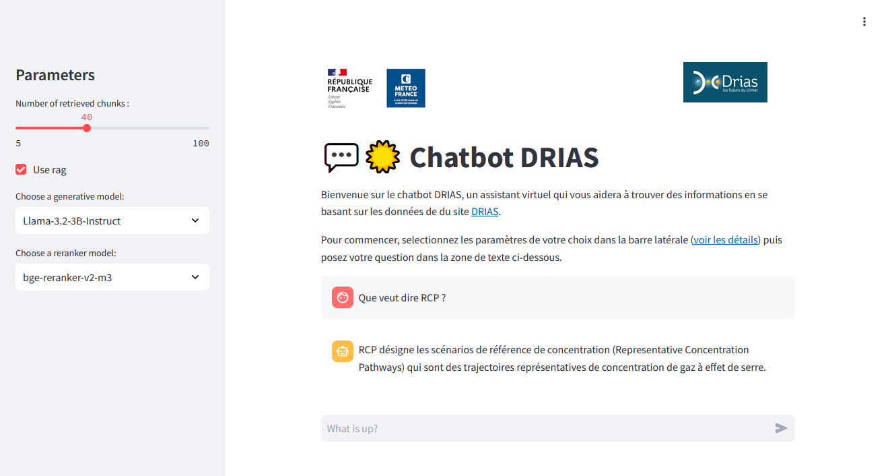

# RAG DRIAS

Our goal is to make a Retrieval Augmented Generation (RAG) on the [DRIAS portal](https://www.drias-climat.fr/).

>LLMs used in specialized fields may create hallucinations due to their lack of knowledge. RAG helps solve this problem by retrieving relevant documents from external knowledge bases.



## Repository Structure
```
rag_drias
└─── docs
└─── rag_drias
│   └─── data.py          # text data management
│   └─── embedding.py     # wrapper for embedding models
│   └─── crawl.py         # website crawling tools
│   └─── settings.py      # settings (paths, model names,...)
└─── main.py              # Main python script
```
## Documentation

Full code documentation of Rag_drias can be found here.

- [1 - Data download](docs/1_download_data.md)
- [2 - Database construction](docs/2_database_construction.md)
- [3 - Retrieval](docs/3_retrieval.md)
- [4 - Generation](docs/4_generation.md)
- [5 - Website](docs/5_website.md)


## Install

1. ```git clone https://github.com/meteofrance/rag_drias.git```

2. Build conda environment:

```bash
    conda env create --file environment.yaml
    conda activate ragdrias
```

3. Change `BASE_PATH` in `rag_drias/settings.py`. This is where all your data and models will be saved.

4. Download manually the different models :

If needed, see install instructions for [git-lfs](https://github.com/git-lfs/git-lfs?tab=readme-ov-file#getting-started).

If needed, setup your HugginFace access token. (needed for Llama3B).

```bash
    cd <BASE_PATH>
    git lfs install   # (should return `Git LFS initialized.`)
    git clone https://huggingface.co/dangvantuan/sentence-camembert-large
    git clone https://huggingface.co/jpacifico/Chocolatine-14B-Instruct-4k-DPO
    git clone https://huggingface.co/meta-llama/Llama-3.2-3B-Instruct  # optionnal
    git clone https://huggingface.co/BAAI/bge-reranker-v2-m3 # optionnal
```


## Usage

1. Crawl the website:

```bash
python main.py crawl
```

2. Prepare the vector database:

```bash
python main.py prepare-database
```

3. Make a query and retrieve the most relevant samples:

```bash
python main.py query "Quels formats de données sont disponibles pour le téléchargement sur DRIAS ?"
```

4. Make a query and retrieve the answer:

```bash
python main.py answer "Quels formats de données sont disponibles pour le téléchargement sur DRIAS ?"
```

add reranker model :

```bash
python main.py answer "Quels formats de données sont disponibles pour le téléchargement sur DRIAS ?" --reranker bge-reranker-v2-m3
```


5. To see what the LLM would answer without the retrieved chunks:

```bash
python main.py answer "Quels formats de données sont disponibles pour le téléchargement sur DRIAS ?" --no-use-rag"
```

Use `--help` to see all available options in the `main.py` script.
