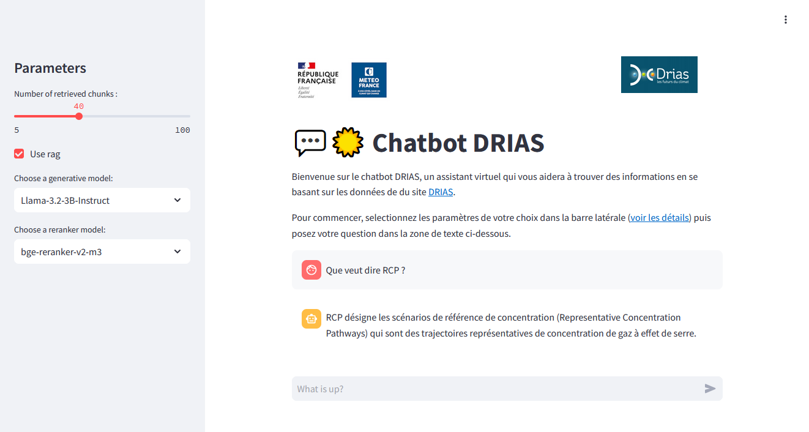

# Website

We made a web interface with the python [streamlit](https://streamlit.io/) library.

## Launching

```bash
streamlit run app.py --server.address 0.0.0.0 --server.port port
```
*port is the port to expose*

<details>
<summary>Meteo France</summary>

On priam the gpus are not powerful enough to run the generative models. So the script must be launched from the ewc. To access the interface from a browser you have to make an ssh tunnel.

on a terminal from priam do:
```bash
ssh -g -L port:0.0.0.0:port ewc
```
*port is the port to expose*
</details>

## Usage



### Parameters

- **Number of retrieved chunks** : choose the number of retrieved chunks that will be given to the generative model
- **Use rag** : enable or disable the use of rag
- **Generative model** : Select the desired generative model from the list. This corresponds to the model that will generate the final response.
- **Reranker model** : Select the desired reranker model from the list. This corresponds to the model that will select the most relevant chunks.


